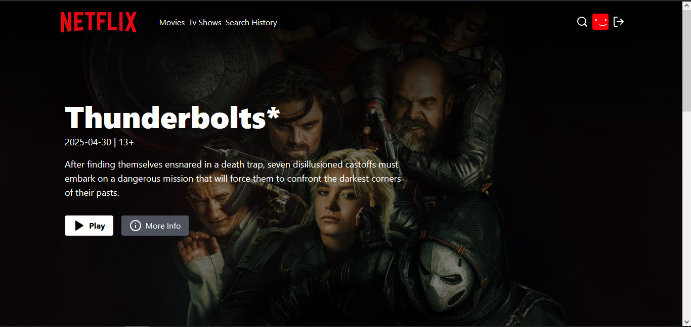

# Netflix Clone - MERN Project

A Netflix-inspired streaming platform built with the MERN stack (MongoDB, Express, React, Node.js).



## Features

- 👤 User authentication (signup, login, logout)
- 🎥 Browse movies and TV shows
- 📺 Video playback functionality
- 🔎 Search functionality
- 👤 User profiles
- 💻 Responsive design
- 📝 Movie/Show details view

## Tech Stack

### Frontend
- React.js
- Redux for state management
- Styled Components/CSS
- Axios for API requests
- React Router for navigation

### Backend
- Node.js
- Express.js
- MongoDB
- Mongoose ODM
- JWT Authentication

## Prerequisites

Before running this application, make sure you have the following installed:
- Node.js (v14 or higher)
- MongoDB
- npm or yarn

## Installation & Setup

1. Clone the repository
```bash
git clone https://github.com/paulustimothy/netflix-clone-mern.git
cd netflix-clone
```

2. Install backend dependencies
```bash
npm install
```

3. Install frontend dependencies
```bash
cd frontend
npm install
```

4. Configure environment variables
Create a `.env` file in the root directory with the following variables:
```env
MONGO_URI=your_mongodb_connection_string
PORT=5000
NODE_ENV=development
JWT_SECRET=your_jwt_secret
TMDB_API_KEY=your_tmdb_api_key
```

## Running the Application

### Development Mode

1. Start the backend server:
```bash
# From the root directory
npm run dev
```

2. Start the frontend development server:
```bash
# From the frontend directory
cd frontend
npm run dev
```

The frontend will be available at `http://localhost:5173`
The backend API will be available at `http://localhost:5000/api`

### Production Mode

To build and run the application in production mode:

```bash
# Build the frontend
cd frontend
npm run build

# Start the production server from the root directory
cd ..
npm start
```

## Acknowledgments

- [TMDB API](https://www.themoviedb.org/documentation/api) for movie data
- Netflix for design inspiration

Special thanks to Codesistency
